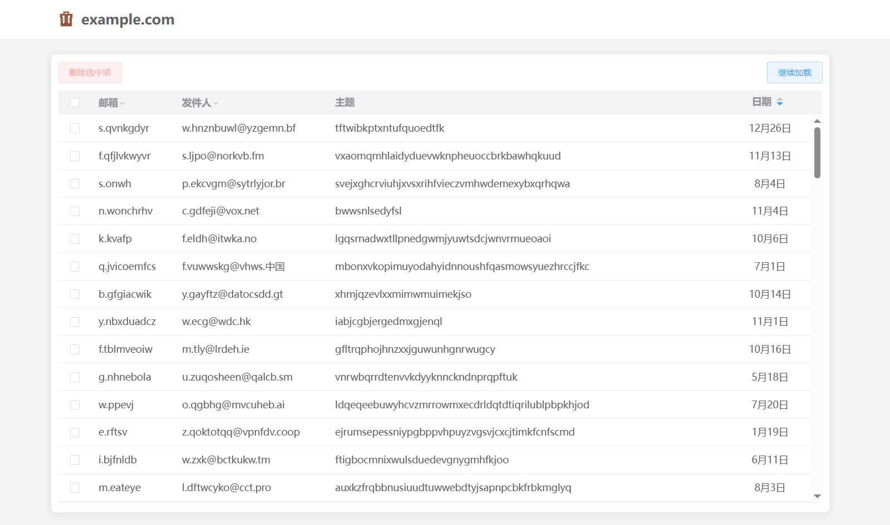

# MailAPP: Cloudflare Worker Email Server

通过 Cloudflare 提供的邮件路由功能，实现的任何前缀都可以收件的自用域名邮箱。

## 截图



## 技术栈

前端：Vue 2.x、ElementUI、Axios

后端：Hono、postal-mime、2fa-utils

## 支持功能

- 接收/查看/删除邮件

# 部署到 Worker

## 构建前端页面

1. 进入 `front/ 目录，下载项目依赖  `pnpm i`；

2. 创建  `config.js`  文件，具体配置内容如下：

    - ```js
      export default {
        title: "",	//页内标题
        baseUrl: "" 	//后端 API 地址
      }
      ```

3. 输入  `pnpm run build`  构建项目，将会在主目录下生成  `public/`  目录来存放构建后的文件。

## 部署后端服务

1. 创建 D1 数据库 `npm run db:create`，同时记下输出内容中用于绑定配置的值 `database_name`  和  `database_id`；
2. 初始化远程数据库结构  `npm run db:init:re`；
3. 返回主目录下，配置  `wrangler.json`  文件，具体配置项如下：
   -  vars 环境变量
      -  `jwtsecret`：用于生成 token 的 secret，随机不限长度的数据字母特殊符号字符串；
      -  `totpsecret`：用于生成和验证基于时间的一次性口令的验证码，通过 [TOTP Generator](https://totp.danhersam.com/) 获取；
      -  `siteurl`：前端页面地址；
      -  `pushurl`：用于推送内容的地址，目前仅支持 GET 请求和路径或查询参数，可用参数如下：
         -  `$title`：邮件主题；
         -  `$body`：格式为  `(收信人) 发件人`  的字符串；
         -  `$url`：查看邮件内容的地址，免登录；
         -  以 Bark 为例子：`https://api.day.app/YOUR_DEVICE_TOKEN/$title/$body?isArchive=1&url=$url`。
   -  d1_databases D1 数据库绑定
      -  `binding`：固定为  `DB`；
      -  `database_name`, `database_id`：对应刚才创建数据库时输出的内容。
4. 配置完以上内容后，即可部署到 Cloudflare Worker 了，输入命令 `npm run deploy`。

## 设置自定义域名

前提：绑定到 Worker 的域名只能是由 Cloudflare 托管的域名。

1. 浏览器进入 Clouflare 网站，接着进入位于左侧菜单栏的 Workes；
2. 找到名为 mailapp 并进入管理页；
3. 找到设置，在设置页的域和路由里添加自定义域名即可。
